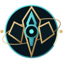
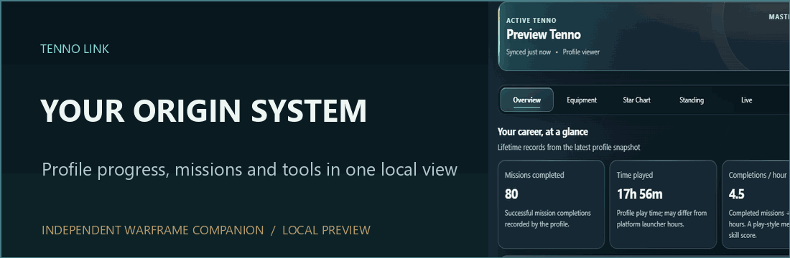
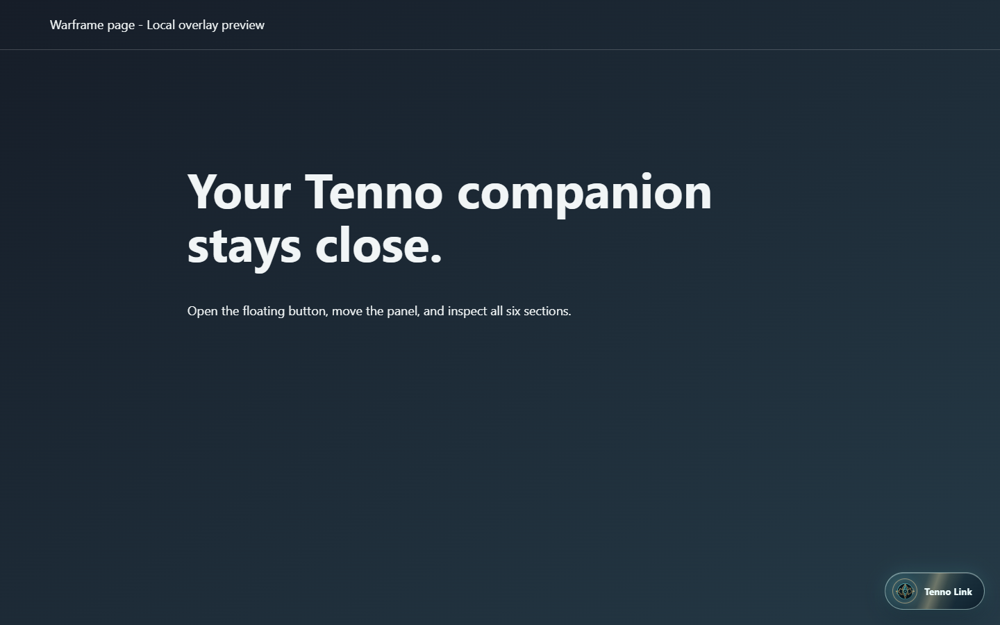
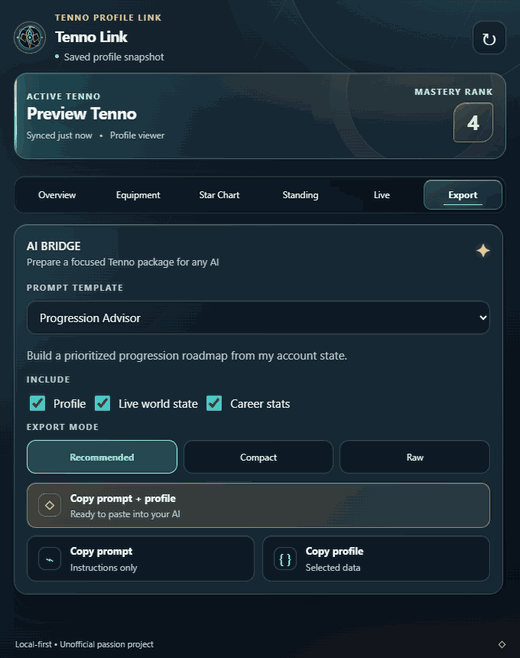
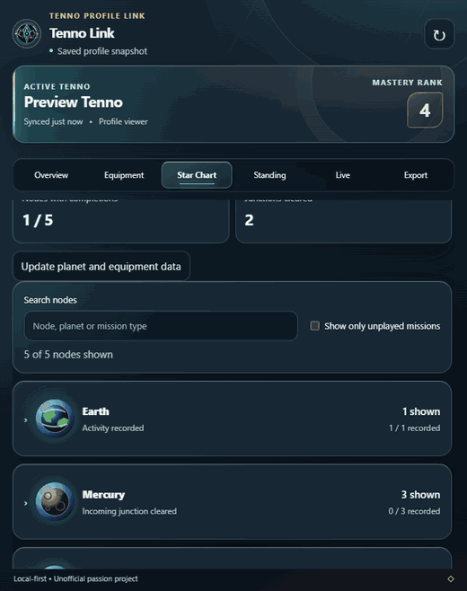

# Tenno Link

**Turn your Warframe profile into better, current-game questions for the AI assistant you choose.**

Tenno Link is an independent Chrome extension built around **AI Bridge**. Choose a goal, add details such as the exact materials you want to farm, and copy a tailored prompt with selected account context. The dashboard, equipment history, Star Chart, and live activities help you understand the data behind that request.

The floating **Tenno Link** button opens the companion while you browse warframe.com. This local website preview shows where the button appears; the account shown in the animations is sample data.

## What you can do

- **Plan with AI Bridge:** Choose from 12 focused plans, add a goal or quantity, preview the prompt, and copy only the profile sections you choose.
- **Understand your account:** See Mastery Rank, career stats, equipment history, standing, and recorded mission completions.
- **Explore the Origin System:** Search Star Chart nodes and filter missions without a recorded completion. Check access in game before planning a route.
- **Follow live activities:** See current PC world events and pin an item to look up possible farming sources.

## AI advice that checks the current game

Overview opens first so you can see what your profile actually reports. When you want advice, open **AI Bridge** from the tab or the Overview shortcut:

1. Choose a template. **Beginner-Friendly Plan** explains the basics; **What Should I Do Next?** picks one action; **Progression Advisor**, **Star Chart Advisor**, and **Quest Planner** map longer routes. Use **Farming Planner** for named materials and quantities, or **Arsenal Review** for equipment decisions. The remaining templates focus on mastery, syndicates, account health, a short session, or a weekly review.
2. Add a specific target and any preferences, such as solo play or avoiding spoilers. Leave fields blank if you want broader suggestions.
3. Choose what to include: **Profile**, **Live world state**, and **Career stats**. **Recommended** is the readable default, **Compact** reduces text, and **Raw** shares more of the source profile. Preview the prompt and review your choices before copying.
4. Select **Copy prompt + profile** to paste the full request into an AI assistant. **Copy prompt** shares no profile package; **Copy profile** shares only the selected data. You choose where to paste it.

The in-app **How AI Bridge works** guide explains the controls at any time. Beginners can start with one immediate goal; experienced players can name a build, farm, unlock, or time limit.

Every AI Bridge prompt asks the receiving assistant to check recent [official patch notes](https://www.warframe.com/en/patch-notes), the [Warframe Wiki](https://wiki.warframe.com/), and [official drop tables](https://www.warframe.com/droptables) when relevant. It asks for source links and dates, and to check whether an older build or farm still works after changes to abilities, weapons, mods, arcanes, or rewards.

**A prompt cannot make an AI browse.** If your assistant cannot verify current information, it should say so and label its advice unverified. You can then provide recent patch notes before acting on a build or farming route.

AI Bridge prepares text locally; Tenno Link does not require an AI API key or send your export to an AI service. Nothing is copied until you press a copy button. The previews above use synthetic sample data.

## Install

1. Download the latest ZIP from [GitHub Releases](https://github.com/JadenAhYuen/tenno-link/releases), then extract it to a folder you can keep.
2. Open `chrome://extensions/` in Chrome and enable **Developer mode**.
3. Choose **Load unpacked** and select the extracted `tenno-link` folder containing `manifest.json`.
4. Sign in at [warframe.com](https://www.warframe.com/), then open Tenno Link. Press **↻** to refresh.

See the [installation guide](docs/INSTALL.md) for update steps and permission details. A Chrome Web Store release is planned.

## Privacy and scope

Profile data is stored in Chrome extension storage. AI Bridge copies only the sections you select, and session cookies are excluded from exports. Read the [privacy policy](PRIVACY.md).

Tenno Link uses Warframe profile data and public world state and item data. Missing profile values are shown as unreported; a mission without recorded completion does not prove it is unlocked, and item metadata does not prove ownership.

Tenno Link is unofficial and is not affiliated with Digital Extremes. Warframe and related trademarks belong to Digital Extremes Ltd.

## Community data credit

Thanks to [Warframe Community Developers (WFCD)](https://github.com/WFCD) for the public [warframe-drop-data](https://github.com/WFCD/warframe-drop-data) used to look up possible farming sources. WFCD parses [Digital Extremes' official drop data](https://www.warframe.com/droptables). Public drop information helps plan a farm; it does not tell Tenno Link what you own or which missions you can enter.

## More information

[Tutorial](docs/TUTORIAL.md) · [Changelog](CHANGELOG.md) · [License](LICENSE) · [Contributing](CONTRIBUTING.md)

Copyright © 2026 Jaden Ah Yuen and Tenno Link contributors.
