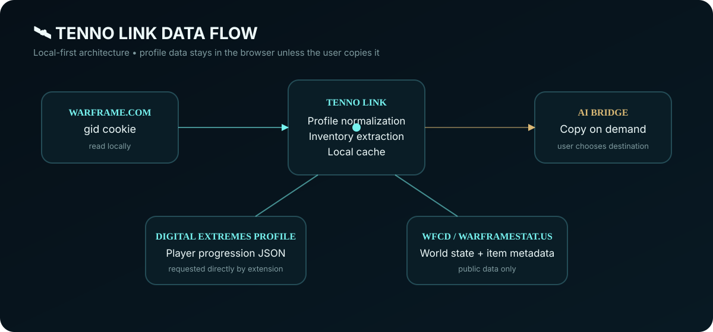
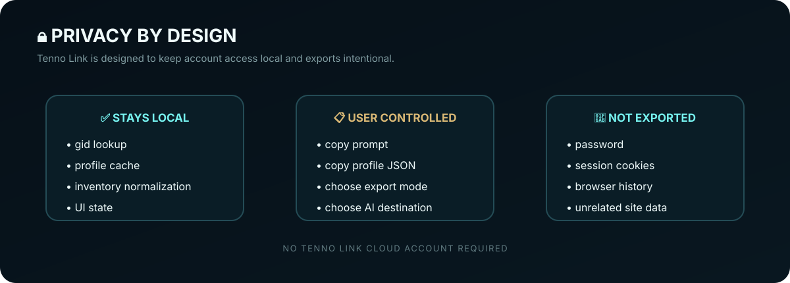
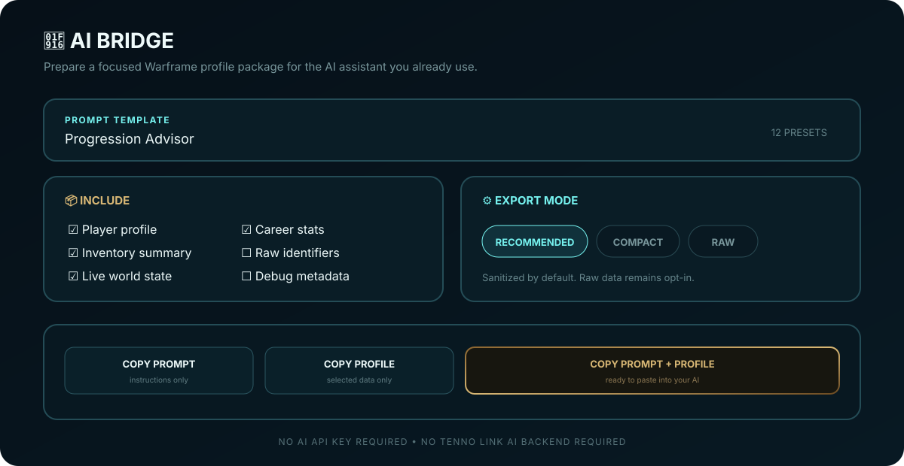

<p align="center">
  
</p>

# ✨ Tenno Link

**Tenno Link** is an unofficial, local-first Warframe profile and AI bridge.

It links your Warframe profile to a compact browser dashboard, combines account data with public world-state information, and prepares privacy-conscious profile packages that you can copy into the AI assistant of your choice.

> 🚧 **Status:** active preview development. Tenno Link is not affiliated with or endorsed by Digital Extremes.

## 🌌 What Tenno Link does

- 🏠 **Home** — Mastery Rank, missions, play time, arsenal counts and career stats
- 🧭 **Progress** — mission, challenge, affiliation, Operator and XP records
- 🔫 **Arsenal** — Warframe/weapon counts and usage statistics
- 📦 **Inventory** — searchable/filterable quantity-bearing profile data
- 🛠️ **Materials Ready** — experimental material-readiness checks using maintained public recipe metadata
- 📡 **Live** — public Warframe world-state information
- 🤖 **AI Bridge** — 12 prompt presets with Recommended, Compact and Raw export modes
- 💾 Cache-aware syncing and local storage
- 🔐 No Tenno Link recommendation backend required

<p align="center">
  
</p>

## 📦 Inventory model

Tenno Link does **not** hardcode example balances or invent resources.

The inventory layer recursively inspects the returned profile JSON for quantity-bearing account structures, normalizes detected entries, and records where each value came from.

Each normalized inventory entry can contain:

```text
id
name
uniqueName
quantity
category
sourcePath
sources[]
confidence
```

Current UI categories include:

```text
CURRENCY  RESOURCES  PARTS  BLUEPRINTS  RELICS  MODS  GEAR  OTHER
```

The model is intentionally defensive because the profile-view payload is not a formally documented inventory API and may change over time.

## 🔎 Searchable inventory

The **Resources** tab now includes:

- 🔍 instant local search
- 🏷️ category filters
- 🔢 formatted quantities
- 🧾 profile-source tracking internally
- 🚫 no fabricated balances
- 🧩 a separate crafting-readiness layer

## 🛠️ Materials Ready

Recipe data is fetched from the maintained WarframeStat.us / WFCD item API rather than permanently hardcoded into the extension.

Tenno Link caches a compact recipe catalog and derives **Materials Ready** by comparing detected inventory quantities against current recipe component quantities.

> ⚠️ **Materials Ready does not mean guaranteed craftable.**

Blueprint ownership, Mastery Rank, quests, clan research and other game requirements remain separate checks.

## 🛰️ How the data flows

<p align="center">
  
</p>

Tenno Link keeps normalization separate from presentation so upstream format changes can be handled in one place.

## 🔒 Privacy by design

<p align="center">
  
</p>

- ✅ Warframe passwords are never collected
- ✅ session cookies are not included in AI exports
- ✅ profile data is cached in Chrome extension storage
- ✅ clipboard export only happens after you press a copy button
- ✅ public world-state/item metadata comes from WarframeStat.us
- 🚫 no Tenno Link cloud account is required

Read the full [privacy policy](PRIVACY.md).

## 🚀 Install

For the current development build:

1. 📥 Download or clone this repository
2. 🌐 Open `chrome://extensions/`
3. 🧑‍💻 Enable **Developer mode**
4. 📂 Click **Load unpacked**
5. ✅ Select the repository folder containing `manifest.json`
6. 🔑 Log in to the official Warframe website
7. 🔄 Open Tenno Link and press **Sync**

See the full [Chrome installation guide](docs/INSTALL.md).

> 🛍️ A Chrome Web Store release is planned for one-click installation and automatic updates.

## 🎓 Tutorial

The [Tenno Link tutorial](docs/TUTORIAL.md) covers:

- 🔗 profile linking
- 📊 dashboard basics
- 📦 inventory search
- 🛠️ material readiness
- 📡 live world-state data
- 🤖 AI export

## 🤖 AI Bridge

<p align="center">
  
</p>

Tenno Link does not require an AI API key. It prepares a prompt and selected profile package locally, then you choose where to paste it.

## 🌐 Data sources

- 🎮 Digital Extremes Warframe profile-view endpoint for player profile data
- 📡 WarframeStat.us / WFCD for public world-state and maintained item metadata

These are treated as upstream dependencies, not as data formats Tenno Link controls.

## 🧪 Testing

The inventory branch includes automated tests for:

- 💰 currency detection
- 📦 quantity-bearing inventory extraction
- ➕ duplicate quantity merging
- 🏷️ category inference
- 🧾 recipe catalog normalization
- ✅ material-readiness calculation
- 🧹 blueprint pseudo-component removal

GitHub Actions also validates the extension manifest and JavaScript syntax.

## 🧑‍💻 Development

Feature work is developed on branches and reviewed through pull requests.

Current inventory work:

```text
feature/inventory-ui
```

For an unpacked extension that is already loaded:

```text
git pull
→ chrome://extensions/
→ Reload
```

## 📜 License & copyright

Tenno Link source code and original project assets are released under the [MIT License](LICENSE).

**Copyright © 2026 Jaden Ah Yuen and Tenno Link contributors.**

Warframe and related trademarks, names and game assets belong to Digital Extremes Ltd. The project license does not grant rights to third-party intellectual property.

## 📚 Project docs

- 🚀 [Install](docs/INSTALL.md)
- 🎓 [Tutorial](docs/TUTORIAL.md)
- 🔒 [Privacy](PRIVACY.md)
- 🛡️ [Security](SECURITY.md)
- 🤝 [Contributing](CONTRIBUTING.md)
- 📦 [Release checklist](RELEASE.md)
- 📝 [Changelog](CHANGELOG.md)

---

<p align="center">
  <strong>⚡ Your profile. Your data. Your AI. ⚡</strong>
</p>
