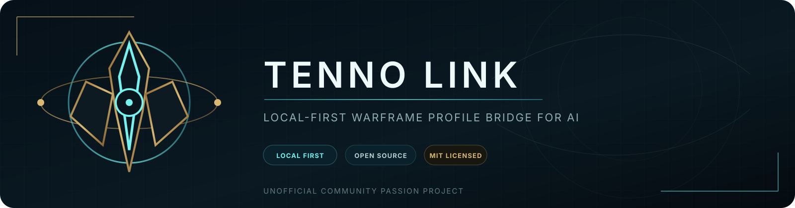
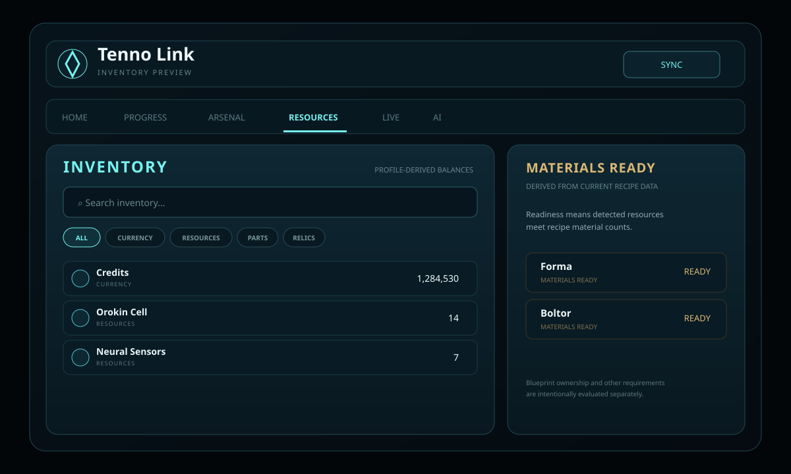

<p align="center">
  
</p>

# Tenno Link

**Tenno Link** is an unofficial, local-first Warframe profile and AI bridge.

It links the player's Warframe profile to a compact browser dashboard, combines account data with public world-state information, and prepares privacy-conscious profile packages that can be copied into the AI assistant of the user's choice.

> **Status:** active preview development. Tenno Link is not affiliated with or endorsed by Digital Extremes.

## Current preview

- **Home**: Mastery Rank, missions, play time, arsenal counts and career statistics
- **Progress**: mission, challenge, affiliation, Operator and XP records
- **Arsenal**: Warframe/weapon counts and weapon usage statistics
- **Inventory**: searchable/filterable quantity-bearing profile data
- **Materials Ready**: experimental material-readiness calculation using maintained public recipe metadata
- **Live**: public Warframe world-state information
- **AI Bridge**: 12 prompt presets with Recommended, Compact and Raw export modes
- Cache-aware profile syncing and local storage
- No Tenno Link recommendation backend required

<p align="center">
  
</p>

## Inventory model

Tenno Link does not hardcode example balances or invent resources.

The inventory layer recursively inspects the returned profile JSON for quantity-bearing account structures, normalizes detected entries, and records their source paths and confidence.

Each normalized inventory entry can contain:

```text
id
name
uniqueName
quantity
category
sourcePath
sources[]
confidence
```

Supported UI categories currently include currency, resources, parts, blueprints, relics, mods, gear, and uncategorized entries.

The model is intentionally defensive because the profile-view payload is not a formally documented inventory API and can change over time.

## Crafting readiness

Recipe data is fetched from the maintained WarframeStat.us/WFCD item API rather than being permanently hardcoded into the extension.

Tenno Link caches a compact recipe catalog and derives **Materials Ready** by comparing detected inventory quantities to current recipe component quantities.

**Materials Ready does not mean guaranteed craftable.** Blueprint ownership, Mastery Rank, quests, clan research and other requirements are separate checks.

## Install

For the current development build, use Chrome Developer Mode:

1. Download or clone this repository.
2. Open `chrome://extensions/`.
3. Enable **Developer mode**.
4. Click **Load unpacked**.
5. Select the repository folder containing `manifest.json`.
6. Log in to the official Warframe website.
7. Open Tenno Link and press **Sync**.

See the full [installation guide](docs/INSTALL.md).

A Chrome Web Store release is planned for one-click installation and automatic updates.

## Tutorial

See [Tenno Link Tutorial](docs/TUTORIAL.md) for profile linking, inventory search, material readiness, live data and AI export.

## Privacy

Tenno Link is local-first.

- Warframe login passwords are never collected.
- Session cookies are not exported in AI packages.
- Profile data is cached in Chrome extension storage.
- Clipboard export occurs only after the user presses a copy action.
- Public world-state/item metadata comes from WarframeStat.us.

Read the full [privacy policy](PRIVACY.md).

## Data sources

- Digital Extremes Warframe profile-view endpoint for player-profile data
- WarframeStat.us / WFCD for public world-state and maintained item metadata

Tenno Link treats these external formats as upstream dependencies and keeps normalization separate from the UI so changes can be handled centrally.

## Development

Feature work is developed on branches and reviewed through pull requests.

Current inventory work lives on:

```text
feature/inventory-ui
```

For an already loaded unpacked extension, pull the latest changes and press **Reload** on `chrome://extensions/`.

## License

Tenno Link source code and original project assets are released under the [MIT License](LICENSE).

Copyright © 2026 Jaden Ah Yuen and Tenno Link contributors.

Warframe and related trademarks, names and game assets belong to Digital Extremes Ltd. The MIT License does not grant rights to third-party intellectual property.

## Project docs

- [Install](docs/INSTALL.md)
- [Tutorial](docs/TUTORIAL.md)
- [Privacy](PRIVACY.md)
- [Security](SECURITY.md)
- [Contributing](CONTRIBUTING.md)
- [Release checklist](RELEASE.md)
- [Changelog](CHANGELOG.md)
