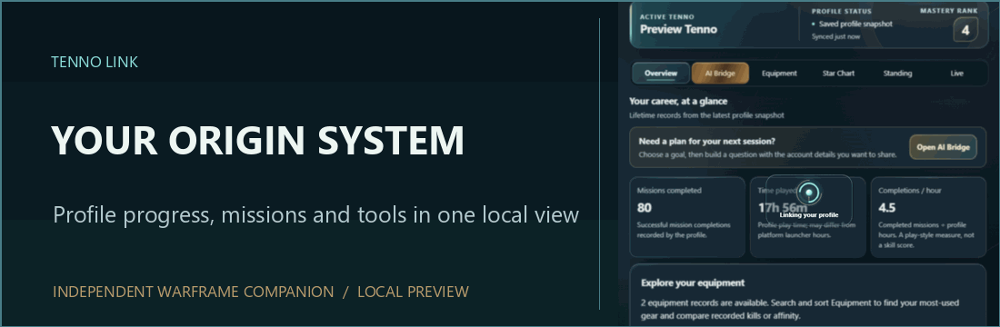
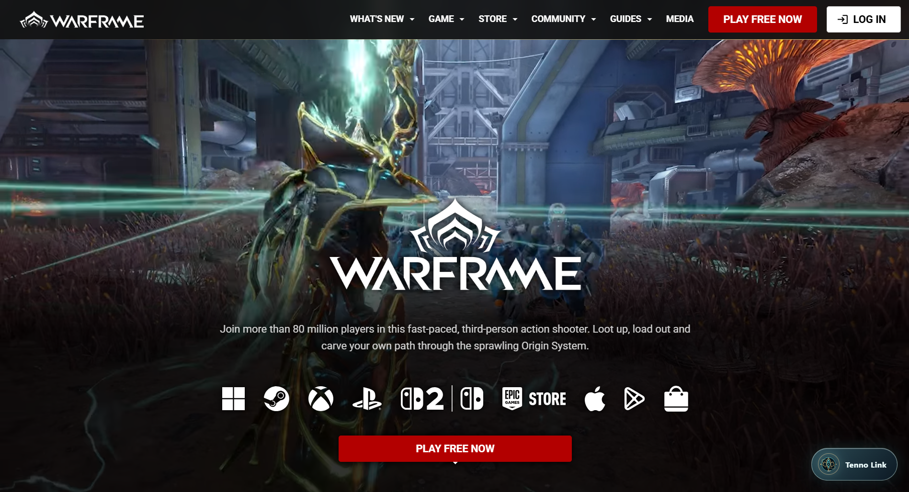
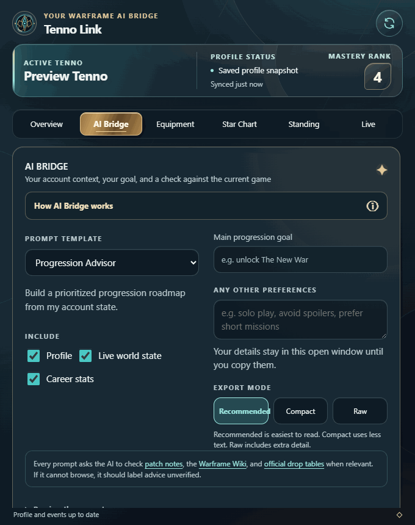
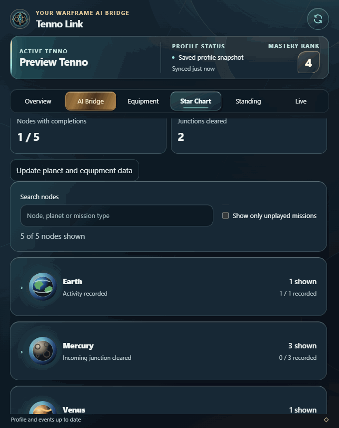

# Tenno Link

**Turn your Warframe profile into better, current-game questions for the AI assistant you choose.**

Tenno Link is an independent Chrome extension built around **AI Bridge**. Choose a goal, add details such as the exact materials you want to farm, and copy a tailored prompt with selected account context. The dashboard, equipment history, Star Chart, and live activities help you understand the data behind that request.

The floating **Tenno Link** button opens the companion while you browse warframe.com or wiki.warframe.com. This local website preview shows where the button appears; the account shown in the animations is sample data.

## What you can do

- **Plan with AI Bridge:** Choose from 12 focused plans, add a goal or quantity, preview the prompt, and copy only the profile sections you choose.
- **Understand your account:** See Mastery Rank, career stats, equipment history, standing, and recorded mission completions.
- **Explore the Origin System:** Search Star Chart nodes and filter missions without a recorded completion. Check access in game before planning a route.
- **Hear cycle changes:** Open **Settings** with the cogwheel beside Refresh. Enable notifications, choose your worlds, and adjust volume. **Cephalon announcements** uses an original bundled voice that names the world, planet and new phase. **Transmission chime** adds a two-second metallic signal before speech or plays on its own when announcements are off. New notification settings default to spoken announcements; existing audio choices are preserved. Preview either while alerts are off. Alerts use API-confirmed PC phases; Chrome must be running, and sleep or network delays can postpone delivery. Reload the extension after updating to grant notification permissions.
- **Follow live activities:** See current PC world events and pin an item to look up possible farming sources.

## AI advice that checks the current game

Overview opens first so you can see what your profile actually reports. When you want advice, open **AI Bridge** from the tab or the Overview shortcut:

1. Choose a template. **Beginner-Friendly Plan** explains the basics; **What Should I Do Next?** picks one action; **Progression Advisor**, **Star Chart Advisor**, and **Quest Planner** map longer routes. Use **Farming Planner** for named materials and quantities, or **Arsenal Review** for equipment decisions. The remaining templates focus on mastery, syndicates, account health, a short session, or a weekly review.
2. Add a specific target and any preferences, such as solo play or avoiding spoilers. Leave fields blank if you want broader suggestions.
3. Choose what to include: **Profile**, **Live world state**, and **Career stats**. **Recommended** is the readable default, **Compact** reduces text, and **Raw** shares more of the source profile. Preview the prompt and review your choices before copying.
4. Select **Copy prompt + profile** to paste the full request into an AI assistant. **Copy prompt** shares no profile package; **Copy profile** shares only the selected data. You choose where to paste it.

The in-app **How AI Bridge works** guide explains the controls at any time. Beginners can start with one immediate goal; experienced players can name a build, farm, unlock, or time limit.

Every AI Bridge prompt asks the receiving assistant to check recent [official patch notes](https://www.warframe.com/en/patch-notes), the [Warframe Wiki](https://wiki.warframe.com/), and [official drop tables](https://www.warframe.com/droptables) when relevant. It asks for source links and dates, and to check whether an older build or farm still works after changes to abilities, weapons, mods, arcanes, or rewards.

**A prompt cannot make an AI browse.** If your assistant cannot verify current information, it should say so and label its advice unverified. You can then provide recent patch notes before acting on a build or farming route.

[Watch the Star Chart search and filter in full-colour WebM](docs/assets/screenshots/mission-filter-banner.webm).

AI Bridge prepares text locally and requires no AI API key. Copy actions place the selected text on your clipboard; provider buttons can also insert it into the chosen AI website. The previews above use synthetic sample data.

AI Bridge also offers logo buttons for **ChatGPT**, **Claude**, **Gemini**, and **Grok**. Allow optional access to the provider you choose, and Tenno Link attempts to fill its new-chat input with the previewed request. You review it and press Send yourself. Existing input is preserved; signing in or a changed website interface may require pasting the clipboard copy instead. Entering text into an AI website is subject to that provider's privacy policy.

Your AI Bridge draft is saved locally between visits, with a **Clear draft** action. The preview includes the complete selected data package, and account identity is hidden by default. A pinned farming goal can pass directly into Farming Planner with its published sources. Overview shows your goal, next missions, activity, data freshness, and changes between recorded profile snapshots. First-time players can use **Try sample data** without signing in.

## Install

1. Download the latest ZIP from [GitHub Releases](https://github.com/JadenAhYuen/tenno-link/releases), then extract it to a folder you can keep.
2. Open `chrome://extensions/` in Chrome and enable **Developer mode**.
3. Choose **Load unpacked** and select the extracted `tenno-link` folder containing `manifest.json`.
4. Sign in at [warframe.com](https://www.warframe.com/), then open Tenno Link. Press **↻** to refresh.

See the [installation guide](docs/INSTALL.md) for update steps and permission details. A Chrome Web Store release is planned.

## Privacy and scope

Profile data is stored in Chrome extension storage. AI Bridge copies only the sections you select, and session cookies are excluded from exports. Read the [privacy policy](PRIVACY.md).

Tenno Link uses Warframe profile data and public world state and item data. Missing profile values are shown as unreported; a mission without recorded completion does not prove it is unlocked, and item metadata does not prove ownership.

Tenno Link is unofficial and is not affiliated with Digital Extremes. Warframe and related trademarks belong to Digital Extremes Ltd.

## Community data credit

Thanks to [Warframe Community Developers (WFCD)](https://github.com/WFCD) for the public [warframe-drop-data](https://github.com/WFCD/warframe-drop-data) used to look up possible farming sources. WFCD parses [Digital Extremes' official drop data](https://www.warframe.com/droptables). Public drop information helps plan a farm; it does not tell Tenno Link what you own or which missions you can enter.

## More information

[Tutorial](docs/TUTORIAL.md) · [Changelog](CHANGELOG.md) · [License](LICENSE) · [Contributing](CONTRIBUTING.md)

Source is available for noncommercial use. Selling Tenno Link, a modified copy,
or access to either requires written permission from the relevant copyright holders.

Copyright © 2026 Jaden Ah Yuen and Tenno Link contributors.

Cycle speech also offers **Cephalon companion**, a bundled original metallic voice pack with 13 offline announcements. Use it in **Settings → Cycle notifications**, then **Preview announcement**. It is inspired by shipboard assistants and does not use Ordis recordings.

Cycle monitoring runs with the companion closed. The floating launcher is available on both [warframe.com](https://www.warframe.com/) and the [Warframe Wiki](https://wiki.warframe.com/). Settings shows the latest 10 cycle alerts with their audio mode and delivery status; stale transitions after sleep are skipped. After updating, reload the extension and refresh existing website tabs.

**Useful Live timer announcements:** Settings also offers opt-in Baro arrival and 30-minute departure warnings, daily Sortie and Steel Path incursion refreshes, weekly Archon Hunts, and Nightwave weekly challenge refreshes. They share the cephalon voice, chime and volume controls. Use **Notification settings** in Live to find them, and select any event in the audio preview. These report public availability, not your completion or eligibility.

Notification settings show mission completion evidence for landscape access. The public profile is not an authoritative unlock list: missing records, quest gates, relay access and Steel Path access remain unconfirmed. Enabling an unconfirmed alert requires **Enable anyway**; existing selections stay enabled. Sample data never confirms real player access. Reopen Settings after syncing to refresh evidence.

The **Farming** tab holds your pinned goal and searches the item catalog across weapons, Warframes, mods, blueprints, parts and materials. It shows catalog recipes, clickable ingredients, listed drop sources (including bounty stages and rotations), vendor costs where published, and a Wiki guide link. Sources are public possibilities, not account ownership or guaranteed availability; missing acquisition data is explicitly shown. Full drop data is cached for ten minutes while the background worker is active, with individual-table fallback.

**Profile request protection:** Player profiles are synced only by manually pressing Refresh. Opening the dashboard, visible-panel refresh and cycle alarms never request profiles. Manual requests share a minimum 15-minute interval across panels and worker restarts. HTTP 403 or 429 pauses profile requests for at least one hour, honoring a longer Retry-After header; Refresh cannot bypass the pause. Live world-state monitoring uses the separate WFCD endpoint. Settings shows the last profile HTTP status and up to 20 local request attempts without identifiers or request URLs. These intervals are conservative extension choices, not a published guarantee from Digital Extremes.
